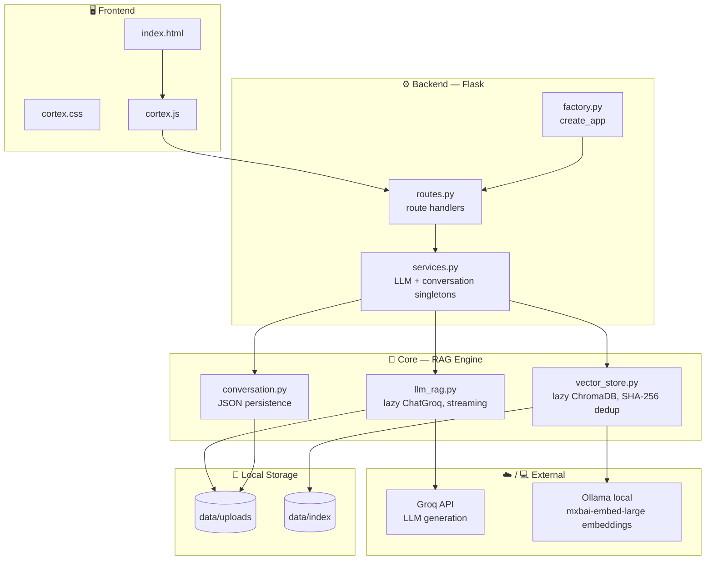

<div align="center">

# CORTEX

**Your documents, answered — no hallucinations.**

A personal knowledge base powered by Retrieval-Augmented Generation.
Upload your documents. Ask anything. Get answers grounded in what you actually gave it — with full conversation memory, and nothing invented.


</div>

---

## Why Cortex

Every team and every person accumulates documents faster than anyone can actually read them — policies, notes, reports, research, contracts. Searching them usually means `Ctrl+F` and hoping you guessed the right keyword, or reading the whole thing end to end.

Cortex takes a different approach. Upload your documents once, then just **ask** — and keep asking. It retrieves the exact relevant passages, hands them to a language model, and answers using only that content, while remembering the flow of your conversation. If the answer isn't in your documents, it says so — it doesn't guess.

---

## Features

| | |
|---|---|
| 📥 **Multi-format ingestion** | Upload PDF files, one at a time or in batches |
| ✂️ **Smart chunking** | Documents are split into overlapping, context-aware chunks for precise retrieval |
| 🔎 **Semantic search** | ChromaDB-powered vector search finds meaning, not just matching keywords |
| 🧹 **Automatic deduplication** | SHA-256 content hashing skips re-embedding documents you've already indexed |
| 🧠 **Grounded reasoning** | Answers strictly from retrieved context — zero hallucination by design |
| 💬 **Persistent conversations** | Full chat history is saved locally, so follow-up questions keep context |
| ⚡ **Streaming responses** | Answers stream in token-by-token instead of appearing all at once |
| 📌 **Full traceability** | Every answer shows exactly which document, chunk, and page it came from |
| 🎛️ **Configurable via env vars** | Every setting can be overridden without touching code |

---

## Architecture

Cortex follows a clean **Flask application-factory pattern**, separating the web layer, business logic, and core RAG engine into distinct modules.



### Request flow

**Indexing — when a document is uploaded:**

```
Upload → routes.py → services.py → vector_store.py
       → SHA-256 dedup check → chunk → Ollama embed → ChromaDB index (data/index/chroma/)
```

**Querying — every time a question is asked:**

```
Ask → routes.py → services.py → conversation.py (load history)
    → vector_store.py (Ollama embed query → retrieve top chunks)
    → similarity threshold check (skip Groq if no relevant content found)
    → llm_rag.py (stream answer via Groq API)
    → conversation.py (save turn) → streamed response to frontend
```

Cortex answers **only** from what's inside the retrieved chunks. If nothing relevant is found, it responds with:

> *"I could not find this in the uploaded documents."*

---

## Tech Stack

| Layer | Technology | Role |
|---|---|---|
| Language | Python 3.11+ | Core language |
| Backend | Flask (app factory pattern) | Routing, request handling |
| WSGI server | Gunicorn | Production-grade server (replaces `flask run`) |
| Frontend | HTML + custom CSS/JS | Black & white, glassmorphic single-page UI |
| Config | `config.py` + env-var overrides | Centralized, override-friendly settings |
| LLM | Groq API (llama-3.1-8b-instant) | Generates grounded, streamed answers |
| Embeddings | Ollama — mxbai-embed-large | Local embedding, runs entirely on your machine |
| Vector Store | ChromaDB, lazy-loaded | Persistent local similarity search |
| Deduplication | SHA-256 hashing | Skips re-indexing identical content |
| Conversation Memory | JSON persistence | Keeps chat history across sessions |
| Storage | Local filesystem | `data/uploads/` and `data/index/` |

---

## Project Structure

```
cortex/
├── app.py                    # Thin entry point (dev / direct run)
├── wsgi.py                   # Gunicorn / WSGI entry point
├── gunicorn.conf.py          # Production Gunicorn settings
├── config.py                 # All settings + env-var overrides
├── requirements.txt
├── .env.example              # Copy to .env and fill in GROQ_API_KEY
├── .gitignore
│
├── backend/
│   ├── __init__.py
│   ├── factory.py             # create_app()
│   ├── routes.py              # All route handlers
│   └── services.py            # LLM + conversation singletons
│
├── core/
│   ├── __init__.py
│   ├── llm_rag.py             # Lazy ChatGroq, streaming, error handling
│   ├── vector_store.py        # Lazy FAISS, SHA-256 dedup, Ollama embeddings
│   └── conversation.py        # JSON persistence
│
├── frontend/
│   ├── templates/
│   │   └── index.html
│   └── static/
│       ├── css/cortex.css
│       ├── js/cortex.js
│       └── favicon.svg
│
└── data/
    ├── uploads/.gitkeep
    └── index/.gitkeep
```

---

## Getting Started

### 1. Clone and set up your environment

```bash
git clone <your-repo-url> cortex
cd cortex
python -m venv venv
source venv/bin/activate      # Windows: venv\Scripts\activate
pip install -r requirements.txt
```

### 2. Get a Groq API key

Groq provides a **free tier** — no credit card required.

1. Go to [console.groq.com](https://console.groq.com) and sign up.
2. Create an API key under **API Keys**.
3. Copy `.env.example` to `.env` and paste your key:

```bash
cp .env.example .env
# then edit .env and set GROQ_API_KEY=<your-key>
```

### 3. Install Ollama (for embeddings)

Ollama still runs locally to generate document embeddings. Download it from [ollama.com/download](https://ollama.com/download), then:

```bash
ollama --version
ollama serve
```

### 4. Pull the embedding model

```bash
ollama pull mxbai-embed-large
```

> **Note:** You no longer need `llama3.2:3b`. Chat generation now runs through Groq. Only the embedding model needs to be pulled locally.

### 5. Configure (optional)

All settings in `config.py` can be overridden via environment variables in your `.env` file:

```bash
GROQ_MODEL=llama-3.1-8b-instant   # or any model available on Groq
EMBED_MODEL=mxbai-embed-large
TOP_K=5
CHUNK_SIZE=800
CHUNK_OVERLAP=100
```

### 6. Run Cortex

**Development:**

```bash
python app.py
```

**Production (Gunicorn):**

```bash
gunicorn -c gunicorn.conf.py wsgi:application
```

Open `http://localhost:5000` (or the host/port you configured).

---

## Production checklist

| | Item |
|---|---|
| ✅ | Set a strong random `SECRET_KEY` in `.env` — `python -c "import secrets; print(secrets.token_hex(32))"` |
| ✅ | Set `FLASK_DEBUG=false` (default) |
| ✅ | Never commit `.env` — it is in `.gitignore` |
| ✅ | Run behind a reverse proxy (nginx, Caddy) for TLS termination |
| ✅ | Tune `GUNICORN_WORKERS` to `2 × CPU + 1` for your server |

---

## Using Cortex

1. **Upload** one or more PDF documents from the interface.
2. Wait for indexing — duplicate files are automatically skipped via SHA-256 hash check.
3. Type a question and send it — the answer **streams in live**.
4. Ask follow-up questions — Cortex remembers the conversation.
5. Check the sources shown with each answer to see exactly where it came from.

---

## Design Principles

- **Grounded, not generative.** Cortex never answers from general knowledge — only from what you gave it.
- **Transparent.** Every answer is traceable back to its exact source.
- **Lazy by design.** Models and indexes load only when needed, keeping startup fast.
- **Fail clearly.** A missing API key or network error surfaces as a readable message in the UI, not a stack trace.
- **Simple over clever.** Clean separation between web layer, services, and core engine — easy to read, easy to extend.

---

## Roadmap

- [ ] OCR support for scanned documents
- [ ] Image understanding
- [ ] Hybrid search (keyword + semantic)
- [ ] Multiple knowledge base collections
- [ ] Voice input
- [ ] Export chat conversations
- [x] ~~Chat history~~ — done via `conversation.py`
- [x] ~~Streaming responses~~ — done via lazy `ChatGroq` streaming

---

<div align="center">

**Cortex** — your documents, answered.

</div>
