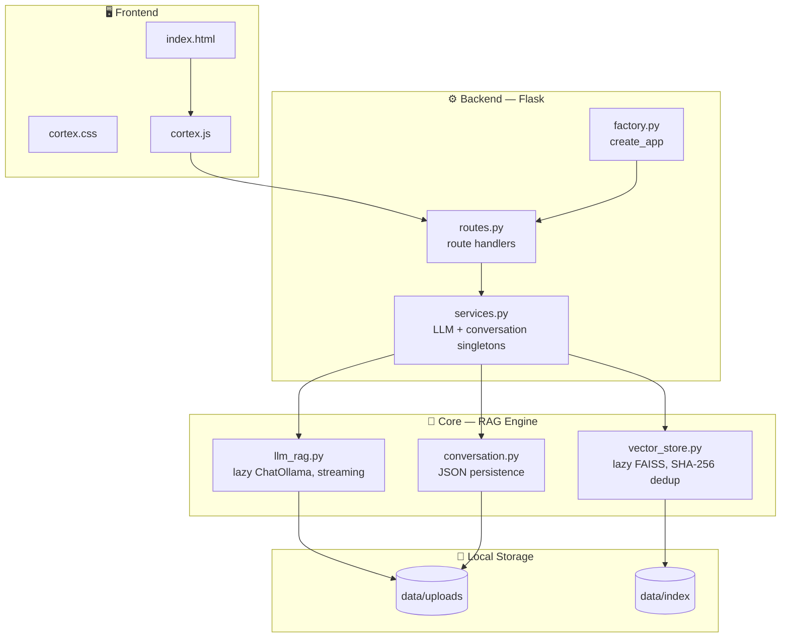

<div align="center">

# CORTEX

**Your documents, answered — fully offline, no hallucinations.**

A personal knowledge base powered by local Retrieval-Augmented Generation.
Upload your documents. Ask anything. Get answers grounded in what you actually gave it — with full conversation memory, and nothing invented.


</div>

---

## Why Cortex

Every team and every person accumulates documents faster than anyone can actually read them — policies, notes, reports, research, contracts. Searching them usually means `Ctrl+F` and hoping you guessed the right keyword, or reading the whole thing end to end.

Cortex takes a different approach. Upload your documents once, then just **ask** — and keep asking. It retrieves the exact relevant passages, hands them to a local language model, and answers using only that content, while remembering the flow of your conversation. If the answer isn't in your documents, it says so — it doesn't guess.

No cloud calls. No API keys. No data leaving your machine. Ever.

---

## Features

| | |
|---|---|
| 📥 **Multi-format ingestion** | Upload PDF, DOCX, TXT, and Markdown files, one at a time or in batches |
| ✂️ **Smart chunking** | Documents are split into overlapping, context-aware chunks for precise retrieval |
| 🔎 **Semantic search** | FAISS-powered vector search finds meaning, not just matching keywords |
| 🧹 **Automatic deduplication** | SHA-256 content hashing skips re-embedding documents you've already indexed |
| 🧠 **Local reasoning** | Llama 3.2 answers strictly from retrieved context — zero hallucination by design |
| 💬 **Persistent conversations** | Full chat history is saved locally, so follow-up questions keep context |
| ⚡ **Streaming responses** | Answers stream in token-by-token instead of appearing all at once |
| 📌 **Full traceability** | Every answer shows exactly which document, chunk, and page it came from |
| 🔌 **Fully offline** | Powered entirely by Ollama — no internet connection required after setup |
| 🎛️ **Configurable via env vars** | Every setting can be overridden without touching code |

---

## Architecture

Cortex follows a clean **Flask application-factory pattern**, separating the web layer, business logic, and core RAG engine into distinct modules.



### Request flow

**Indexing — when a document is uploaded:**

```
Upload → routes.py → services.py → vector_store.py
       → SHA-256 dedup check → chunk + embed → FAISS index (data/index/)
```

**Querying — every time a question is asked:**

```
Ask → routes.py → services.py → conversation.py (load history)
    → vector_store.py (retrieve top chunks) → llm_rag.py (stream answer via Ollama)
    → conversation.py (save turn) → streamed response to frontend
```

Cortex answers **only** from what's inside the retrieved chunks. If nothing relevant is found, it responds with:

> *"I couldn't find this information in your uploaded documents."*

---

## Tech Stack

| Layer | Technology | Role |
|---|---|---|
| Language | Python 3.12+ | Core language |
| Backend | Flask (app factory pattern) | Routing, request handling |
| Frontend | HTML + custom CSS/JS | Black & white, glassmorphic single-page UI |
| Config | `config.py` + env-var overrides | Centralized, override-friendly settings |
| LLM Runtime | Ollama | Runs models entirely on your machine |
| Language Model | Llama 3.2 (3B), lazy-loaded | Generates grounded, streamed answers |
| Vector Store | FAISS, lazy-loaded | Fast local similarity search |
| Deduplication | SHA-256 hashing | Skips re-indexing identical content |
| Conversation Memory | JSON persistence | Keeps chat history across sessions |
| Storage | Local filesystem | `data/uploads/` and `data/index/` |

No SQL. No Docker. No cloud. No paid APIs. No accounts.

---

## Project Structure

```
cortex/
├── app.py                    # Thin entry point
├── config.py                 # All settings + env-var overrides
├── requirements.txt
├── .gitignore
├── LICENSE
│
├── backend/
│   ├── __init__.py
│   ├── factory.py             # create_app()
│   ├── routes.py               # All route handlers
│   └── services.py             # LLM + conversation singletons
│
├── core/
│   ├── __init__.py
│   ├── llm_rag.py              # Lazy ChatOllama, streaming
│   ├── vector_store.py          # Lazy FAISS, SHA-256 dedup
│   └── conversation.py          # JSON persistence
│
├── frontend/
│   ├── templates/
│   │   └── index.html
│   └── static/
│       ├── css/cortex.css
│       ├── js/cortex.js
│       └── favicon.svg
│
└── data/
    ├── uploads/.gitkeep
    └── index/.gitkeep
```

---

## Getting Started

### 1. Clone and set up your environment

```bash
git clone <your-repo-url> cortex
cd cortex
python -m venv venv
source venv/bin/activate      # Windows: venv\Scripts\activate
pip install -r requirements.txt
```

### 2. Install Ollama

Download it from [ollama.com/download](https://ollama.com/download), then confirm it's installed:

```bash
ollama --version
ollama serve
```

### 3. Pull the required models

```bash
ollama pull llama3.2:3b
ollama pull mxbai-embed-large
```

### 4. Configure (optional)

All settings live in `config.py` and can be overridden with environment variables — no code changes needed:

```bash
export LLM_MODEL=llama3.2:3b
export EMBED_MODEL=mxbai-embed-large
export TOP_K=5
```

### 5. Run Cortex

```bash
python app.py
```

Open the local URL shown in your terminal — usually `http://localhost:5000`.

---

## Using Cortex

1. **Upload** one or more documents from the interface.
2. Wait for indexing — duplicate files are automatically skipped via hash check.
3. Type a question and send it — the answer **streams in live**.
4. Ask follow-up questions — Cortex remembers the conversation.
5. Check the sources shown with each answer to see exactly where it came from.

---

## Screenshots

<div align="center">

*(Add screenshots here once available)*

`screenshots/upload.png` · `screenshots/chat.png` · `screenshots/sources.png`

</div>

---

## Design Principles

- **Grounded, not generative.** Cortex never answers from general knowledge — only from what you gave it.
- **Private by default.** No cloud calls, no telemetry, no accounts. Everything stays local.
- **Transparent.** Every answer is traceable back to its exact source.
- **Lazy by design.** Models and indexes load only when needed, keeping startup fast.
- **Simple over clever.** Clean separation between web layer, services, and core engine — easy to read, easy to extend.

---

## Roadmap

- [ ] OCR support for scanned documents
- [ ] Image understanding
- [ ] Hybrid search (keyword + semantic)
- [ ] Multiple knowledge base collections
- [ ] Voice input
- [ ] Export chat conversations
- [x] ~~Chat history~~ — done via `conversation.py`
- [x] ~~Streaming responses~~ — done via lazy `ChatOllama` streaming

---


<div align="center">

**Cortex** — your documents, answered.

</div>